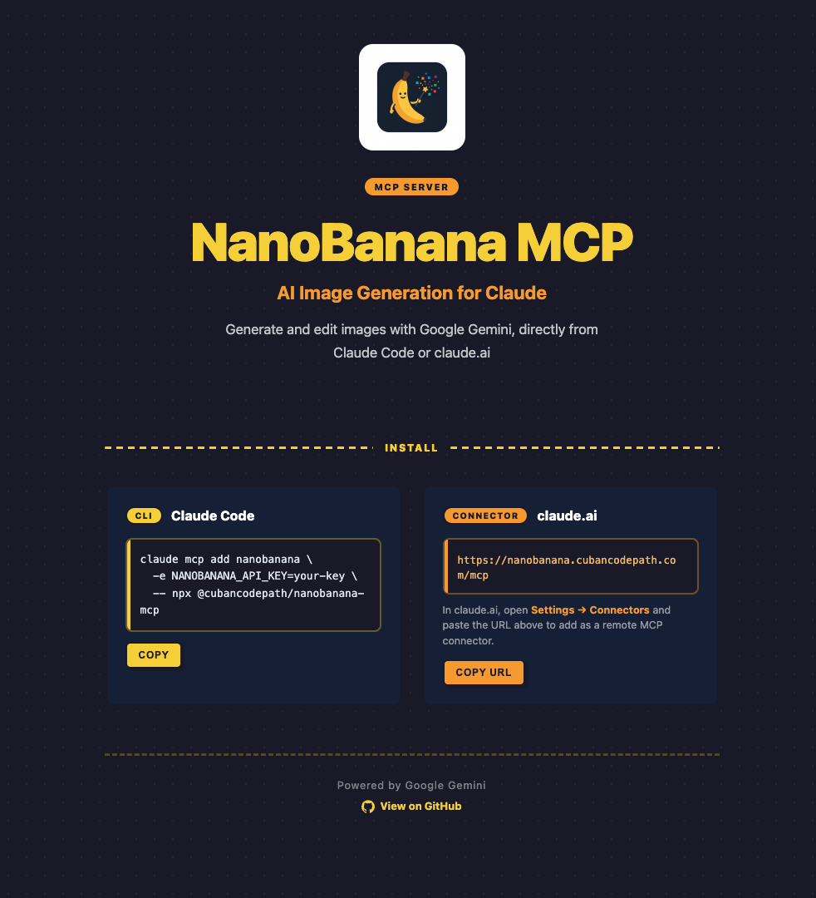

# NanoBanana MCP

<p align="center">
  <a href="https://nanobanana.cubancodepath.com">
    
  </a>
</p>

<p align="center">
  <a href="https://www.npmjs.com/package/@cubancodepath/nanobanana-mcp"></a>
  <a href="https://nanobanana.cubancodepath.com"></a>
</p>

An MCP (Model Context Protocol) server for AI image generation powered by Google Gemini. Works with Claude Code (local) and claude.ai Connectors (remote via Cloudflare Workers).

## Features

- **Text-to-Image** - Generate images from descriptive text prompts
- **Image Editing** - Edit existing images using text instructions
- **Multiple Models** - Choose between `flash` (fast) and `pro` (high quality)
- **Configurable Output** - Aspect ratio, resolution (512 to 4K), and format options
- **Dual Deployment** - Run locally via stdio or remotely on Cloudflare Workers
- **Image Storage** - Remote: images uploaded to R2 with public URLs (auto-deleted after 7 days). Local: optional `output_path` to save images to disk

## Quick Install (Claude Code)

```bash
claude mcp add nanobanana -e NANOBANANA_API_KEY=your-api-key -- npx @cubancodepath/nanobanana-mcp
```

Get your API key from [aistudio.google.com/apikey](https://aistudio.google.com/apikey). Restart Claude Code and start generating images.

## Quick Install (claude.ai)

Add as a Connector in **Settings > Connectors** with URL:

```
https://nanobanana.cubancodepath.com/mcp
```

## Tools

| Tool | Description |
|------|-------------|
| `generate_image` | Generate an image from a text prompt |
| `edit_image` | Edit an existing image using a text prompt and base64 image data |

### Parameters

**generate_image:**
| Parameter | Required | Description |
|-----------|----------|-------------|
| `prompt` | Yes | Descriptive text of the image to generate |
| `model` | No | `flash` (default, faster) or `pro` (higher quality) |
| `aspect_ratio` | No | `1:1` (default), `2:3`, `3:2`, `3:4`, `4:3`, `9:16`, `16:9`, etc. |
| `image_size` | No | `512`, `1K` (default), `2K`, `4K` |
| `output_path` | No | File path to save the image locally (Claude Code only) |

**edit_image:**
| Parameter | Required | Description |
|-----------|----------|-------------|
| `prompt` | Yes | Description of the desired edit |
| `image_base64` | Yes | Base64-encoded image data |
| `image_mime_type` | No | `image/png` (default), `image/jpeg`, `image/webp` |
| `model` | No | `flash` (default) or `pro` |
| `aspect_ratio` | No | Aspect ratio for the output |
| `image_size` | No | Resolution for the output |
| `output_path` | No | File path to save the image locally (Claude Code only) |

### Output behavior

- **Claude Code (local)**: Returns the image inline (base64) so Claude can see it. If `output_path` is provided, also saves the image to disk.
- **claude.ai (remote)**: Uploads the image to Cloudflare R2 and returns both the inline image and a public download URL. Images are automatically deleted after 7 days.

## Self-hosting

If you want to deploy your own instance, this project is a **pnpm monorepo** with two packages:

| Package | Description |
|---------|-------------|
| `packages/mcp` | MCP server — Cloudflare Worker (Durable Objects, KV, R2) + npm package |
| `packages/landing` | Landing page — Astro site deployed as Cloudflare Worker with static assets |

### Prerequisites

- Node.js 18+
- [pnpm](https://pnpm.io/) 10+
- A [Cloudflare account](https://dash.cloudflare.com/sign-up) (free tier works)
- A Google Gemini API key from [aistudio.google.com/apikey](https://aistudio.google.com/apikey)

### Install from source

```bash
git clone https://github.com/cubancodepath/nanobanana-mcp.git
cd nanobanana-mcp
pnpm install
pnpm build
```

### Deploy MCP Worker

```bash
# Create required resources
npx wrangler kv namespace create "OAUTH_KV"
npx wrangler r2 bucket create nanobanana-images
npx wrangler r2 bucket lifecycle add nanobanana-images "auto-delete-7d" --expire-days 7 --force

# Update packages/mcp/wrangler.jsonc with your KV id

# Set secrets
npx wrangler secret put NANOBANANA_API_KEY
npx wrangler secret put COOKIE_ENCRYPTION_KEY    # openssl rand -hex 32
npx wrangler secret put AUTH_SECRET_TOKEN         # your personal access token

# Deploy
pnpm deploy:mcp
```

### Deploy Landing

```bash
pnpm deploy:landing
```

### Custom Domain (optional)

To serve both the landing page and MCP from the same domain:

1. Assign a custom domain to the landing Worker in the Cloudflare dashboard
2. Add Worker Routes for `/mcp*`, `/authorize*`, `/token*`, `/register*`, `/images/*`, `/.well-known/*` pointing to the MCP Worker

## Architecture

```
nanobanana-mcp/
├── packages/
│   ├── mcp/                   # MCP server
│   │   ├── src/
│   │   │   ├── index.ts       # Local stdio entry point (Claude Code)
│   │   │   ├── worker.ts      # Cloudflare Worker entry point (claude.ai)
│   │   │   ├── auth-handler.ts # OAuth + secret token auth + R2 images
│   │   │   ├── api/
│   │   │   │   ├── client.ts  # Gemini API client
│   │   │   │   └── types.ts   # TypeScript interfaces
│   │   │   └── tools/
│   │   │       ├── generate.ts # generate_image tool
│   │   │       ├── edit.ts     # edit_image tool
│   │   │       └── format.ts   # Response formatting
│   │   └── wrangler.jsonc     # Worker config (DO, KV, R2)
│   └── landing/               # Landing page
│       ├── src/pages/
│       │   └── index.astro    # Landing page
│       ├── src/styles/
│       │   └── global.css     # Comic-style CSS
│       └── wrangler.jsonc     # Worker config (static assets)
├── .github/workflows/
│   ├── deploy-mcp.yml         # CI/CD: deploy Worker on push
│   ├── deploy-landing.yml     # CI/CD: deploy landing on push
│   └── publish-npm.yml        # CI/CD: publish to npm on release
├── pnpm-workspace.yaml
└── package.json               # Root scripts
```

## Development

```bash
# Install dependencies
pnpm install

# Build all packages
pnpm build

# Local MCP development (stdio)
pnpm dev:mcp

# Local landing development
pnpm dev:landing

# Deploy MCP Worker
pnpm deploy:mcp

# Deploy landing
pnpm deploy:landing
```

## CI/CD

Deployments are automated via GitHub Actions:

| Workflow | Trigger | Action |
|----------|---------|--------|
| Deploy MCP Worker | Push to `packages/mcp/**` | Build + deploy Worker |
| Deploy Landing | Push to `packages/landing/**` | Build + deploy landing |
| Publish to npm | GitHub Release | Build + publish to npm |

Required GitHub secrets: `CLOUDFLARE_API_TOKEN`, `CLOUDFLARE_ACCOUNT_ID`, `NPM_TOKEN`.

## License

ISC
