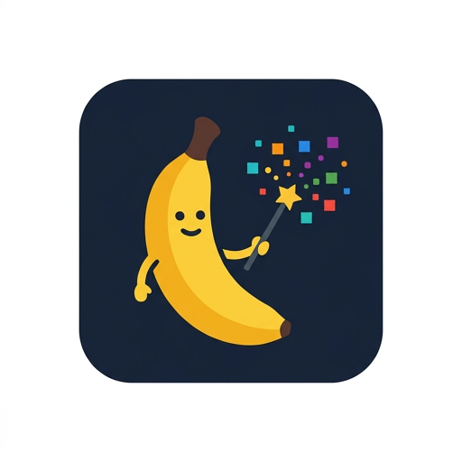

# NanoBanana MCP

<p align="center">
  
</p>

An MCP (Model Context Protocol) server for AI image generation powered by Google Gemini. Works with Claude Code (local) and claude.ai Connectors (remote via Cloudflare Workers).

## Features

- **Text-to-Image** - Generate images from descriptive text prompts
- **Image Editing** - Edit existing images using text instructions
- **Multiple Models** - Choose between `flash` (fast) and `pro` (high quality)
- **Configurable Output** - Aspect ratio, resolution (512 to 4K), and format options
- **Dual Deployment** - Run locally via stdio or remotely on Cloudflare Workers
- **Image Storage** - Remote: images uploaded to R2 with public URLs (auto-deleted after 7 days). Local: optional `output_path` to save images to disk

## Tools

| Tool | Description |
|------|-------------|
| `generate_image` | Generate an image from a text prompt |
| `edit_image` | Edit an existing image using a text prompt and base64 image data |

### Parameters

**generate_image:**
| Parameter | Required | Description |
|-----------|----------|-------------|
| `prompt` | Yes | Descriptive text of the image to generate |
| `model` | No | `flash` (default, faster) or `pro` (higher quality) |
| `aspect_ratio` | No | `1:1` (default), `2:3`, `3:2`, `3:4`, `4:3`, `9:16`, `16:9`, etc. |
| `image_size` | No | `512`, `1K` (default), `2K`, `4K` |
| `output_path` | No | File path to save the image locally (Claude Code only) |

**edit_image:**
| Parameter | Required | Description |
|-----------|----------|-------------|
| `prompt` | Yes | Description of the desired edit |
| `image_base64` | Yes | Base64-encoded image data |
| `image_mime_type` | No | `image/png` (default), `image/jpeg`, `image/webp` |
| `model` | No | `flash` (default) or `pro` |
| `aspect_ratio` | No | Aspect ratio for the output |
| `image_size` | No | Resolution for the output |
| `output_path` | No | File path to save the image locally (Claude Code only) |

### Output behavior

- **Claude Code (local)**: Returns the image inline (base64) so Claude can see it. If `output_path` is provided, also saves the image to disk.
- **claude.ai (remote)**: Uploads the image to Cloudflare R2 and returns a public download URL. Images are automatically deleted after 7 days.

## Setup

### Prerequisites

- Node.js 18+
- A Google Gemini API key from [aistudio.google.com/apikey](https://aistudio.google.com/apikey)

### Installation

```bash
git clone https://github.com/your-username/nanobanana-mcp.git
cd nanobanana-mcp
npm install
npm run build
```

## Usage

### Option 1: Local (Claude Code)

Add the MCP server to Claude Code:

```bash
claude mcp add nanobanana -e NANOBANANA_API_KEY=your-api-key -- node /path/to/nanobanana-mcp/dist/index.js
```

Restart Claude Code and start generating images:

```
> Generate an image of a sunset over the ocean
> Generate an image of a cat, save it to /tmp/cat.png
```

### Option 2: Remote (claude.ai Connectors via Cloudflare Workers)

Deploy as a remote MCP server so you can use it from claude.ai in the browser.

#### 1. Cloudflare Account Setup

You need a [Cloudflare account](https://dash.cloudflare.com/sign-up) (free tier works).

#### 2. Create KV Namespace and R2 Bucket

```bash
# KV namespace for OAuth
npx wrangler kv namespace create "OAUTH_KV"

# R2 bucket for storing generated images
npx wrangler r2 bucket create nanobanana-images

# Auto-delete images after 7 days
npx wrangler r2 bucket lifecycle add nanobanana-images "auto-delete-7d" --expire-days 7 --force
```

Copy the KV `id` from the output and update `wrangler.jsonc`:

```jsonc
"kv_namespaces": [
  {
    "binding": "OAUTH_KV",
    "id": "your-kv-id-here"
  }
]
```

#### 3. Set Secrets

```bash
# Your Gemini API key
npx wrangler secret put NANOBANANA_API_KEY

# Cookie encryption key (generate with: openssl rand -hex 32)
npx wrangler secret put COOKIE_ENCRYPTION_KEY

# Secret token to protect access (only you should know this)
npx wrangler secret put AUTH_SECRET_TOKEN
```

#### 4. Deploy

```bash
npm run worker:deploy
```

Your server will be available at `https://nanobanana-mcp.your-subdomain.workers.dev`.

#### 5. Connect to claude.ai

1. Go to **claude.ai > Settings > Connectors > Add custom connector**
2. **Name**: NanoBanana
3. **URL**: `https://nanobanana-mcp.your-subdomain.workers.dev/mcp`
4. When redirected to the authorization page, enter your `AUTH_SECRET_TOKEN`
5. Done! Start generating images in claude.ai

Generated images will include a download URL that stays active for 7 days.

## Architecture

```
nanobanana-mcp/
├── src/
│   ├── index.ts           # Local stdio entry point (Claude Code)
│   ├── worker.ts          # Cloudflare Worker entry point (claude.ai)
│   ├── auth-handler.ts    # OAuth + secret token auth + image serving
│   ├── api/
│   │   ├── client.ts      # Gemini API client
│   │   └── types.ts       # TypeScript interfaces
│   └── tools/
│       ├── generate.ts    # generate_image tool (local, with output_path)
│       ├── edit.ts        # edit_image tool (local, with output_path)
│       └── format.ts      # Response formatting (base64 inline)
├── wrangler.jsonc         # Cloudflare Workers config (DO, KV, R2)
├── tsconfig.json          # TypeScript config (local build)
└── tsconfig.worker.json   # TypeScript config (worker type-check)
```

## Development

```bash
# Local development (stdio)
npm run dev

# Worker local development
npm run worker:dev

# Build for production
npm run build

# Deploy worker
npm run worker:deploy
```

## License

ISC
